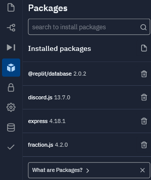

# Discord Math Games Bot by BDimension7

This Discord bot brings the AoPS Reaper game to Discord with additional features:

- Point donations
- Dueling
- Lifetime leaderboard

### Available Commands

- $reap
- $lb (leaderboard)
- $info (lifetime leaderboard)
- $clock
- $donate @player amount
- $help
- $duel @player

### Default Settings

- 50% chance player ranked below steals time (11PM-7AM EST)
- 30% tax at night (doesn't apply to donation)

### Default Modifications For Low Player Count

Let $t$ be the number of milliseconds reaped. If $t > 10,000$, then $t$ is updated to $\sqrt{t \cdot 10^7}$.

### Installation

The bot is hosted on [Repl.it](https://replit.com) and written in JavaScript.

To run on Repl.it, install these packages with the Repl.it Package Manager:

- @replit/database
- discord.js
- express
- fraction.js

### Roadmap

- Implement dueling reward system
- Implement time robbery
- Implement donation limits
- Restore free reap feature
- Greed Control
